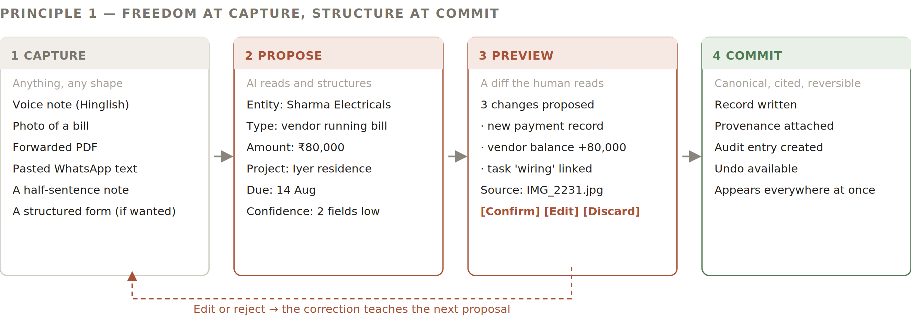

# 2 — Design Principles

Eight rules. Each one has a test, so a reviewer can fail a screen against it without debate.
2.1  The eight principles
#
Principle
The rule
Fails if
P1
Freedom at capture,
structure at commit
The user may dump anything in any shape. The system proposes the filing. The user accepts or corrects.
The fastest way to record something is a form.
P2
No silent writes
AI never modifies data directly. It composes a change preview; a human confirms.
Any data changed without a diff the user saw.
P3
The layout law
Composed answers vary in content, never in position. Answer top-left, evidence right, working area centre, actions bottom.
Two Canvas answers put the same kind of thing in different places.
P4
Show what we don’t know
Gaps are displayed, counted and fillable — never hidden behind a plausible-looking screen.
A total is shown that quietly excludes unknowns.
P5
Every number carries
its source
Any figure can be traced to a document, a message, or a person who said so, in one click.
A figure exists that cannot be traced.
P6
Pin what works
Personalisation happens by keeping things, not by configuring things.
A useful arrangement can only be recreated by asking again.
P7
The system speaks first
The product opens with what changed and what needs the user, not with a blank search box.
The user has to know what to ask to get value.
P8
Three taps
Any action performed more than once a week costs at most three taps from anywhere.
A frequent action requires navigating to find it.
2.2  P1 in detail — the capture pipeline
This is the principle the entire product hangs from, and the one that resolves the tension between freedom and minimal cognitive load. Total freedom at the point of capture; strict structure at the point of commit. The user never fills a form to record reality; they hand reality over and approve the filing.

*Figure 1 — The capture pipeline. Four stages, one confirmation gate.*
WHY THIS RESOLVES THE TENSION
A blank canvas is maximum freedom and maximum cognitive load. A rigid form is minimum freedom and minimum thought. Splitting them puts the freedom where the user is busy (capture) and the structure where the risk is (commit) — and the confirmation step is the only moment that costs attention.
