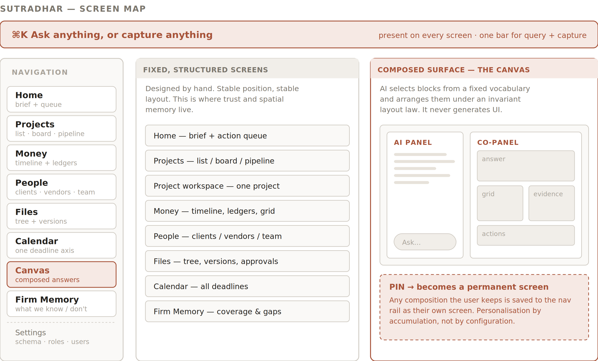

# 4 — Information Architecture

Eight destinations, one global bar, one composed surface. Seven of the eight are hand-designed and stable. The eighth — Canvas — is assembled at query time from a fixed component vocabulary.

*Figure 2 — Screen map. Fixed screens carry trust and spatial memory; the Canvas carries freedom.*
4.1  The destinations
Destination
Purpose
Primary object
Default view
Home
What changed, and what needs you today
The brief + action queue
Merged brief above queue
Projects
Every project, live and in pipeline
Project
List; toggles to pipeline board
Money
The firm’s money on one axis
Payment
Money timeline
People
Clients, vendors, team
Entity
Segmented list
Files
Documents, drawings, versions
File / folder
Tree per project
Calendar
Every deadline in the firm on one axis
Deadline
Month, with week toggle
Canvas
Any question the fixed screens do not answer
The composed answer
Empty, with three suggested questions
Firm Memory
What we know, what we don’t, where it came from
Coverage
Coverage by area
Settings
Schema, roles, users
—
Tucked in the rail footer
4.2  Navigation rules
	•	Home and the Action Queue are one screen. The brief sits on top, the queue below it. Fewer places to learn, and the first screen both tells the user what happened and hands them the work.
	•	Records open as overlay panels, not new pages. Clicking a vendor from a payment grid slides a panel over the current context; closing it returns the user exactly where they were. Nothing loses its place.
	•	The Pipeline is a mode of Projects, not a destination. Same objects, different lens. A lead becomes a project by moving stage, never by being re-created.
	•	Reports are not a destination. They are report blocks composed on the Canvas and pinned. A separate Reports section would compete with the Canvas and split the mental model.
	•	Search is an overlay, invoked from the global bar. It never becomes a page.
	•	Pinned Canvases appear in the rail below Firm Memory. The user’s own screens sit alongside ours, visually identical.
4.3  The global bar
One bar, present on every screen, invoked by ⌘K or by clicking. It is both the question box and the capture box — the user does not have to know which they are doing.
Input
Behaviour
A question
Opens the Canvas with that question already running.
A statement of fact
Treated as capture. Produces a change preview. “Sharma bill 80k Iyer site” never becomes a search.
A file, photo or paste
Treated as capture. Extraction runs, change preview follows.
An object name
Jump-to. “Iyer” navigates to the project.
Ambiguous input
The bar offers both interpretations as two buttons rather than guessing. One extra tap is cheaper than a wrong write.

THREE-TAP CHECK (P8)
Record a payment from anywhere: ⌘K → speak or paste → Confirm. Three. This is the single most frequent action in the product and it must never require navigating to Money first.
