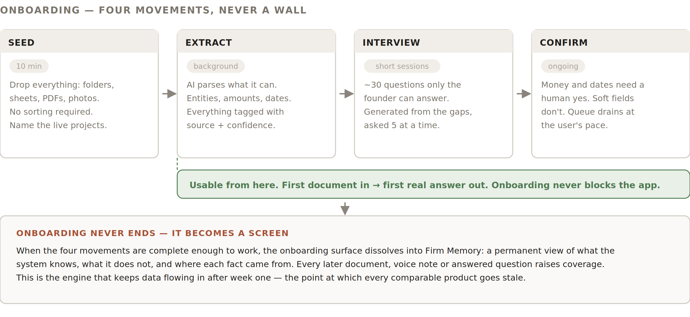
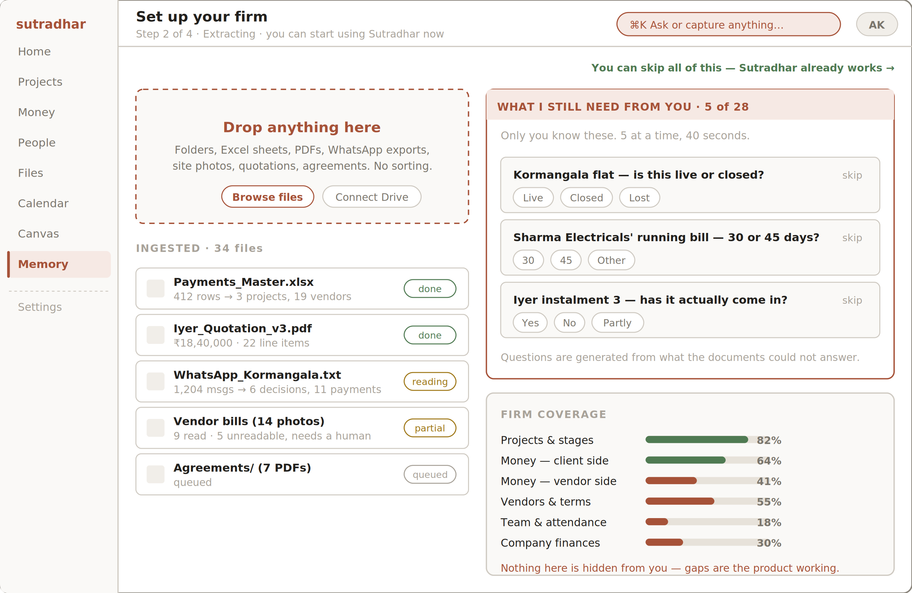
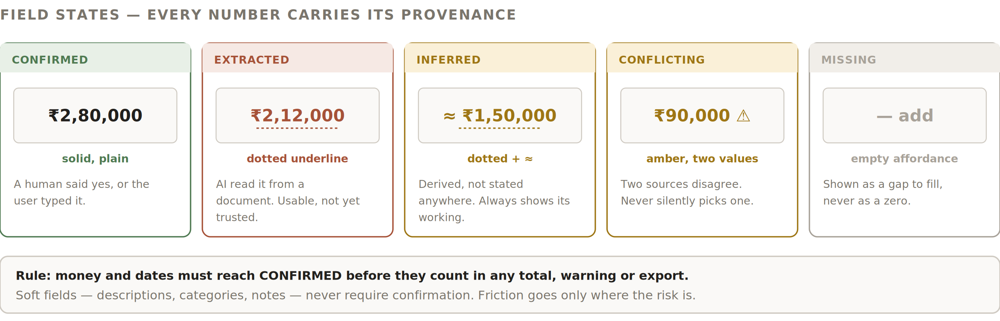

# 5 — Onboarding

The first ten minutes decide whether this product is ever opened again. Because roughly four in five of the firm’s information types live only in a head or a conversation (§1.2), onboarding is primarily an act of elicitation — the document upload is the easy half.
5.1  The three rules
	•	It never blocks. The product is usable after the first document. There is a visible “skip all of this” route on every onboarding screen.
	•	It never finishes. When it is complete enough to work, the onboarding surface dissolves into Firm Memory (§6.8) and continues there permanently.
	•	It never pretends. Coverage is shown as a number from the first minute. A 34% firm looks like a 34% firm.
5.2  The four movements

*Figure 3 — Onboarding as four overlapping movements, not four sequential steps.*
Movement
User does
System does
Exit
1  Seed
Drops folders, sheets, PDFs, photos, WhatsApp exports. Names which projects are live.
Accepts anything. No file-type gate, no naming convention, no sorting.
First file accepted
2  Extract
Nothing. Can leave.
Parses in the background. Every extracted fact tagged with source and confidence. Unreadable files listed honestly rather than dropped.
First entity written
3  Interview
Answers short bursts of questions.
Generates questions from what the documents could not answer. Five at a time, tappable answers wherever possible.
User stops; resumes later
4  Confirm
Says yes, corrects, or skips.
Queues every money figure and date for confirmation. Soft fields pass without asking.
Never — it becomes the Action Queue
5.3  The onboarding screen

*Figure 4 — Onboarding. Ingestion left, elicitation right, honesty along the bottom.*
Region
Specification
Drop zone
Dominant, always visible, accepts folders and multi-select. Also offers Drive connection. Copy names real artefacts (“WhatsApp exports, site photos, quotations”) so the user recognises their own mess.
Ingested list
One row per file or batch. Shows what was found, not just that it succeeded — “412 rows → 3 projects, 19 vendors”. Failures are stated: “5 unreadable, needs a human”.
Question panel
Maximum five questions visible. Each has tappable answers and a skip. Never a text field where a choice would do. Skipping is recorded, and re-asked later at most twice.
Coverage panel
Six areas with percentage bars. Deliberately shows the low numbers. Copy: “gaps are the product working”.
Skip affordance
Persistent, top-right, phrased as reassurance rather than escape: “You can skip all of this — Sutradhar already works”.
5.4  The interview
Roughly thirty questions, generated rather than scripted. A question earns its place only if it meets all three tests:
	•	Only a human in the firm can answer it — no document contains it.
	•	Answering it unblocks something concrete (a ledger, a warning, a total).
	•	It can be answered in under ten seconds, ideally by tapping.

Question shapes, in priority order:
Priority
Shape
Example
1
Live-or-not
“Kormangala flat — live, closed, or lost?”
2
Money truth
“Iyer instalment 3 — has it actually come in?”
3
Terms
“Sharma’s running bill — 30 or 45 days?”
4
Ownership
“Who is responsible for the café fitout enquiry?”
5
Judgement
“How likely is the HSR duplex to convert?”
6
History
“Would you work with Kumar Carpentry again?”

INTERVIEW PLACEMENT
The interview is not confined to onboarding. Questions surface in three places forever: the Action Queue (batched), Firm Memory (browsable), and contextually — when the admin opens a vendor with no recorded terms, the question is right there. Answering in context is where most of them will actually get answered.
5.5  Confidence and provenance
Every fact in the system has a state. The state is visible in the interface, not buried in metadata — this is what makes the product trustworthy enough to replace an Excel sheet the founder wrote themselves.

*Figure 5 — The five field states and their visual treatment.*
State
Meaning
Counts in totals?
Visual
Confirmed
A human said yes, or typed it directly.
Yes
Plain
Extracted
Read from a document by AI. Usable, not yet trusted.
Money and dates: no.
Soft fields: yes.
Dotted underline
Inferred
Derived, not stated in any source.
No
Dotted + ≈ prefix
Conflicting
Two sources disagree.
No
Amber, both values shown
Missing
Known to be absent.
Excluded, and the exclusion is stated
Empty affordance, never a zero

THE CONFIRMATION RULE — WHERE FRICTION IS ALLOWED TO EXIST
Money and dates must reach Confirmed before they count in any total, warning or export.
Soft fields — descriptions, categories, notes, tags — never require confirmation. This is the whole friction budget of the product, and it is spent only where a wrong number does damage.
5.6  Past projects versus live projects
Two different bars, and conflating them is the fastest way to make the product feel wrong.

Past projects
Live projects
What it is for
Searchable memory, vendor track record, profitability hindsight.
Operational state that drives warnings and decisions.
Accuracy bar
Lossy is fine. A 70%-complete archive is useful.
Must be correct. A wrong live figure produces a wrong warning.
Flow
Bulk, unattended, no confirmation queue.
Guided per project. Money confirmed line by line.
Interface
Progress bar and a count. No questions asked.
A per-project checklist that shows exactly what is still unverified.
In the demo
Three archived projects, referenced once to show vendor history.
Two live projects, fully specified — Iyer Residence and Kormangala.
5.7  Prototype implementation note
BUILD THIS DELIBERATELY
Extraction is pre-computed for the demo bundle. The prepared synthetic documents map to a known result set. Ingestion animates at a realistic pace and can be walked through live, but it does not depend on a model call succeeding in front of an advisor.
Genuinely live: the Canvas, the change preview, and any document dropped in ad hoc during the demo (with a visible “this one is running live” state, because that moment is worth showing).
