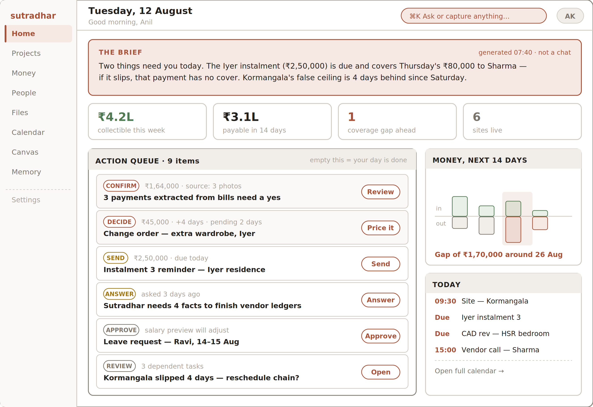
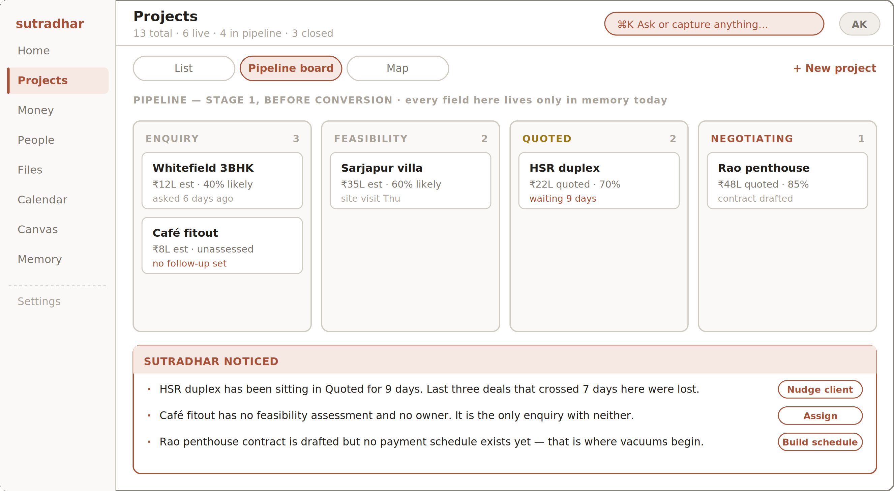
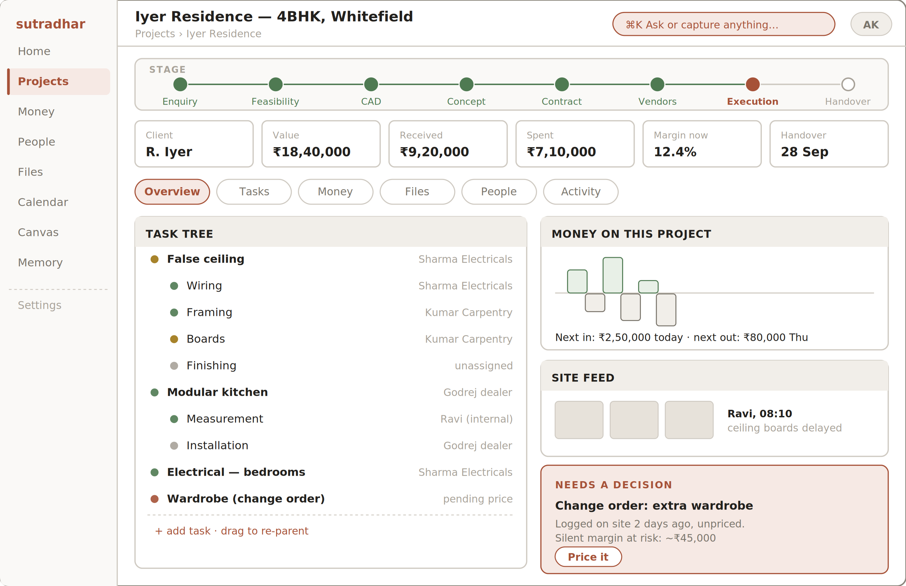
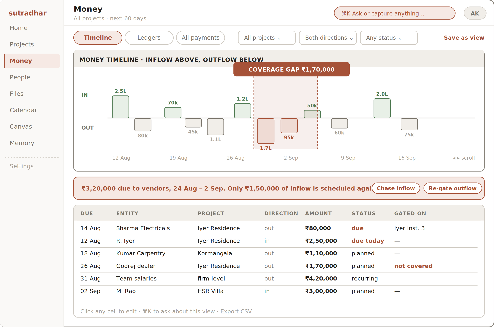
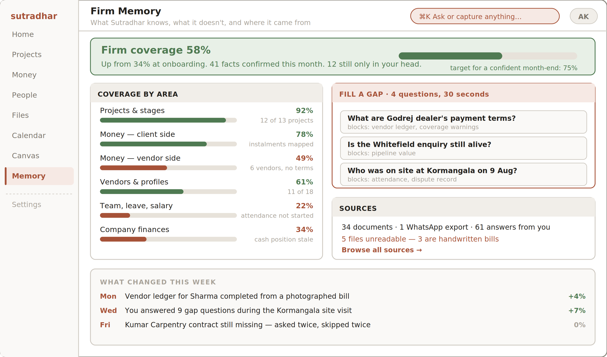

# 6 — The Fixed Screens

Seven destinations plus Settings. Each is specified as: purpose, layout, blocks used, states, actions, and role differences. Blocks referenced here are defined in Section 8.
6.1  Home — the brief and the queue
The most important screen in the product, because it is the one that makes it a habit. It answers two questions before the user asks anything: what changed, and what needs me.

*Figure 6 — Home. Brief on top, action queue below, money and today on the right.*
Region
Specification
The Brief
Two to four sentences, regenerated each morning and after any material change. Written as prose, not bullets, and never as a chat message — it is a report, not a conversation. It states consequence, not just fact: not “instalment due today” but “the instalment due today is what covers Thursday’s vendor payment”. Timestamped, with a visible “generated 07:40” so it is never mistaken for live chat.
Pulse cards
Four figures maximum: collectible this week, payable in 14 days, coverage gaps ahead, live sites. Each is a link into a pre-filtered view. Numbers only — no sparklines, no deltas, no decoration.
Action Queue
Every item that needs a human, in one list, each with a one-tap primary action. Item types: CONFIRM (extracted data), DECIDE (change orders, approvals), SEND (reminders), ANSWER (gap questions), APPROVE (leave, salary), REVIEW (slippage, conflicts). Sorted by consequence, not by date. Copy under the header: “empty this = your day is done”.
Money, next 14 days
A miniature money timeline. Coverage gaps rendered in accent. Clicking opens Money with the same window pre-selected.
Today
Deadlines, site visits and due payments for the current day only. Links into Calendar.

State
Behaviour
Queue empty
Celebratory, not blank. States what is coming tomorrow and offers one optional gap question.
First run
Brief explains what it will do tomorrow. Pulse cards show what coverage they need to become real.
Low coverage
Brief openly caveats: “I can only see the client side of the money so far.”
Team role
Brief is scoped to their sites. Queue shows only their items. No pulse cards, no money panel.
6.2  Projects and the pipeline
One destination, three modes: list, pipeline board, map. The pipeline matters disproportionately because every field in it — feasibility, likelihood, expected profit, follow-up state — currently exists only in the founder’s memory. It is the purest demonstration of the product’s premise.

*Figure 7 — Projects in pipeline mode, with proactive observations below.*
Region
Specification
Mode switch
List (default), Pipeline board, Map. Mode is remembered per user.
Board columns
Enquiry → Feasibility → Quoted → Negotiating. Drag to move stage; converting to a live project is a stage move, never a re-entry.
Card
Name, estimated value, likelihood, and one line of state. Ageing is shown in accent when it exceeds the firm’s own historical pattern.
“Sutradhar noticed”
Two to four proactive observations below the board, each with an action chip. This is the clearest place in the product to show that the system is watching, because these are exactly the things that fall through today.
List mode
A data grid (Block 02) over all projects: stage, client, value, received, spent, margin, next deadline, health. Fully sortable, filterable, saveable as a view.
6.3  Project workspace
One project, everything about it. The stage stepper across the top is the firm’s own lifecycle — the one already documented in v0.1 §6.1 — not an abstract kanban.

*Figure 8 — Project workspace, Overview tab.*
Region
Specification
Stage stepper
Eight stages: Enquiry, Feasibility, CAD, Concept, Contract, Vendors, Execution, Handover. Current stage in accent, completed in green. Clicking a stage shows what happened in it and what it produced.
Fact row
Client, value, received, spent, margin now, handover date. Margin is live and admin-only.
Tabs
Overview, Tasks, Money, Files, People, Activity. Money tab hidden for Team role.
Task tree
Block 08. Nests to any depth, drag to re-parent, each node carries assignee, deadline, status and optional linked payment. Status dots: green on track, amber slipping, grey unassigned, accent needs a decision.
Money panel
Project-scoped money timeline plus next-in / next-out in one line.
Site feed
Latest photos and supervisor notes, newest first, with author and time.
Needs a decision
A persistent accent panel for anything unpriced or unapproved on this project. In the demo this holds the unpriced change order — the margin-leak story made visible.
6.4  Money
The flagship screen from v0.1, unchanged in ambition: every rupee planned before it is spent, every planned rupee with a date and a status. The interface addition here is that coverage gaps are computed and displayed continuously rather than discovered.

*Figure 9 — Money in timeline mode, with a coverage gap detected and the grid below.*
Region
Specification
Mode switch
Timeline (default), Ledgers, All payments.
Money timeline
Block 03. Inflows above the axis, outflows below, by date. Scrollable horizontally, default window 60 days. Firm-wide by default, filterable to one project.
Coverage gap
A shaded band wherever scheduled outflow exceeds cleared-plus-scheduled inflow. Labelled with the shortfall in rupees. This is the single most valuable pixel in the product and it should look like it.
Warning strip
One sentence stating the gap in plain language, with two actions: chase the inflow, or re-gate the outflow. Both open a change preview — neither writes directly.
Payment grid
Block 02. Columns: due, entity, project, direction, amount, status, gated on. Inline editable. “Gated on” is the vacuum-prevention primitive made visible — a vendor payment can be linked to the client instalment that funds it.
Save as view
Any filter combination becomes a named view in the rail. This is P6 applied to the most-queried data in the firm.
6.5  People
Three segments of one entity model: clients, vendors, team. Segmented control at the top, shared record structure underneath.
Segment
Record contains
Notable
Clients
Contacts, projects (current and historical), instalment ledger, approvals given, items pending with them.
The cross-project history is new — no client-level record exists in the firm today.
Vendors
Category, contacts, payment terms, contracts and work orders, running ledger, activity log, performance notes.
Missing terms are shown as gaps, not blanks. The activity log is the dispute-resolution asset.
Team
Role, assigned work across projects, load view, leave, salary structure.
Salary is admin-only. Load view exists so the admin stops assigning by gut feel.
6.6  Files
	•	Folder tree per project, plus a firm-level tree. The firm defines the hierarchy; we do not impose one.
	•	Versions with an explicit “current for execution” marker. This ends the “carpenter built from the old PDF” failure. The marker is visually loud.
	•	Approval stamps. A drawing can be marked client-approved with a date. Approvals are project history, not chat history.
	•	Every file is a source. Any figure extracted from a file links back to it, opening in the document viewer (Block 05) at the relevant passage.
6.7  Calendar
One axis for every deadline in the firm: task deadlines, payment due dates, stage gates, site visits, leave. Month view default, week toggle. Filterable by project, person and type. Read-mostly — items are created where they live, not here.
6.8  Firm Memory
Where onboarding goes to live permanently, and the screen that most directly expresses the product’s honesty. It is also the engine that keeps data flowing in after week one — the point at which comparable products go stale.

*Figure 10 — Firm Memory. Coverage, gaps, sources, and what changed.*
Region
Specification
Coverage header
One headline percentage, the delta since onboarding, and a target. Framed as progress, never as failure.
Coverage by area
Six areas with bars and a one-line reason for each shortfall (“6 vendors, no terms”). Clicking an area opens the gaps behind it.
Fill a gap
The interview, permanently available. Each question states what it unblocks — “blocks: vendor ledger, coverage warnings”. Motivation is the point.
Sources
Counts of documents, exports and human answers. Unreadable files listed honestly, with the reason.
What changed
A weekly log of coverage movement, including the uncomfortable line — “asked twice, skipped twice”.
6.9  Settings
Deliberately thin, and the only place in the product that looks like configuration. It exists because the schema-freedom promise in §7.5 has to be true somewhere.
Editable
Not editable
Stage names and order
Vendor and cost categories
Custom fields on any entity
Folder tree conventions
Users and roles
Notification and quiet hours
Entity types themselves
What a payment means
The direction model (in / out)
The field-state model
The audit log
