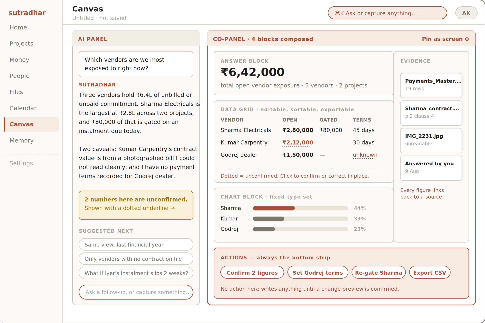
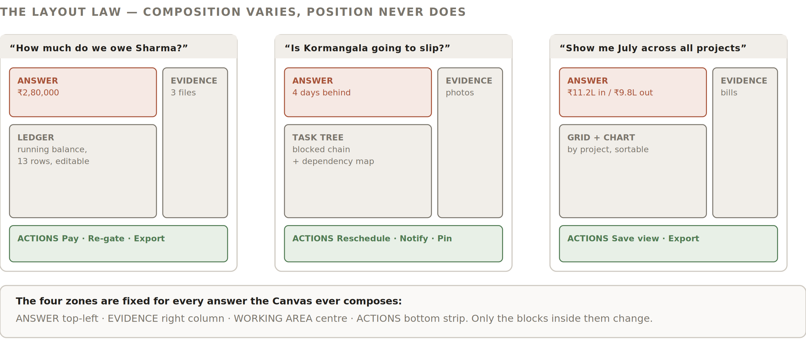

# 7 — The Canvas

The screen the product is bought for. Everywhere else answers questions we anticipated; the Canvas answers the ones we did not — which, in a firm where four fifths of the information used to live in one person’s head, is most of them.
7.1  The concept
Two panels. An AI panel on the left holds the conversation and the reasoning. A co-panel on the right assembles the answer from pre-built components. The AI chooses which blocks and what data goes in them. It never invents a block, a layout, or a chart type.

*Figure 11 — The Canvas. Conversation left, composed answer right, actions along the bottom.*
7.2  The two panels
Panel
Contains
Rules
AI panel
The question, the answer in prose, caveats, and suggested follow-ups.
Prose is bounded — roughly 120 words. If the answer needs more, it belongs in a block, not a paragraph.
Caveats are mandatory when any figure is unconfirmed, and they name which figure.
Follow-up suggestions are three, generated from the data actually retrieved, never generic.
Co-panel
Two to five composed blocks under the layout law.
Every block is live: editable in place, exportable, pinnable.
Unconfirmed figures carry the dotted treatment here too, and can be confirmed inline without leaving the Canvas.
If the answer is a single number, the co-panel still renders — an answer block plus its evidence. It never collapses to chat alone.
7.3  The layout law
The risk with a composed surface is that it varies enough that users lose spatial memory — which would reintroduce the learning curve through the side door, defeating the USP. The layout law is the mitigation: composition varies, position never does.

*Figure 12 — Three different questions, three different compositions, one invariant zone map.*
Zone
Position
Always holds
Never holds
Answer
Top-left
The headline figure or finding, in one line.
A table, a chart, or more than two sentences.
Evidence
Right column, full height
Source cards — documents, messages, human answers, with what each contributed.
Data the user is meant to act on.
Working area
Centre-left, below the answer
Grids, ledgers, trees, timelines, charts. One to three blocks.
The primary answer, or the actions.
Actions
Bottom strip, full width
Chips for every action the answer implies, plus export and pin.
Anything that writes without a change preview.
7.4  Composition rules
	•	Two to five blocks. Fewer than two is a chat reply, not an answer. More than five is a dashboard nobody reads.
	•	Block selection is deterministic per answer shape. A “how much” question produces answer + ledger or grid. A “will it slip” question produces answer + task tree + evidence. A “compare” question produces answer + grid + chart. The mapping is a lookup table in the build, not a free choice — it must be reproducible across demo runs.
	•	The chart type is chosen from a fixed set. Bar, horizontal bar, timeline, stacked bar. No pies, no scatter, no invented visual encodings.
	•	Nothing renders that cannot be traced. If a figure has no source, it does not appear in the co-panel — it appears in the AI panel as a caveat.
7.5  Pinning — where freedom becomes personalisation
THE RESOLUTION OF “FREEDOM” VERSUS “MINIMAL COGNITIVE LOAD”
Any composition the user keeps becomes a permanent screen in their rail. They designed it by asking a question, not by configuring anything.
A pinned Canvas re-runs its query on open, keeps its blocks and arrangement, can be renamed, and sits visually identical to the screens we shipped. Over a month, each firm ends up with a product shaped to how it actually thinks — with zero setup burden and no settings page involved.

Pinned screens are per-user by default, with a “share with the firm” option. Admin-pinned screens containing money data are never visible to Team.
7.6  Worked examples
Question
AI panel
Co-panel composition
“Which vendors are we most exposed to right now?”
Total exposure, largest vendor named, the gating relationship called out, two caveats naming the unconfirmed figures.
Answer (₹6.42L) · Grid (vendor, open, gated, terms) · Chart (share of exposure) · Evidence (4 sources) · Actions (confirm, set terms, re-gate, export)
“Will Kormangala hit its handover date?”
Days behind, the blocking chain, what would recover it, what the last comparable slip cost.
Answer (4 days behind) · Task tree (blocked chain highlighted) · Timeline (revised dates) · Evidence (site photos, supervisor notes) · Actions (reschedule, notify client, pin)
“Show me July across all projects”
In, out, net, and the one anomaly worth noticing.
Answer (₹11.2L in / ₹9.8L out) · Grid (by project) · Chart (in vs out) · Evidence (ledger, bills) · Actions (save view, export)
“Sharma ka bill aa gaya, 80 hazaar, Iyer site”
Recognised as capture, not a question. No prose answer.
Change preview only (Block 09), with the source attached
7.7  When the Canvas cannot answer
Three distinct failures, three distinct responses. Never a generic apology, and never a fabricated answer.
Failure
Response
We don’t hold the data
Say so, name what is missing, and offer the gap question inline. “I have no payment terms for Godrej dealer. Want to add them now?” The failure becomes a data-entry moment.
The question is ambiguous
Offer two or three readings as buttons. Never guess, never ask an open-ended clarifying question — tapping is cheaper than typing.
Out of role scope
State plainly that this is admin-only. Never hint at the figure, never say “approximately”.

The detailed failure-state design — retry behaviour, partial answers, timeout handling — is deferred (§11.2, open decision O2). The three responses above are the minimum the prototype must implement.
