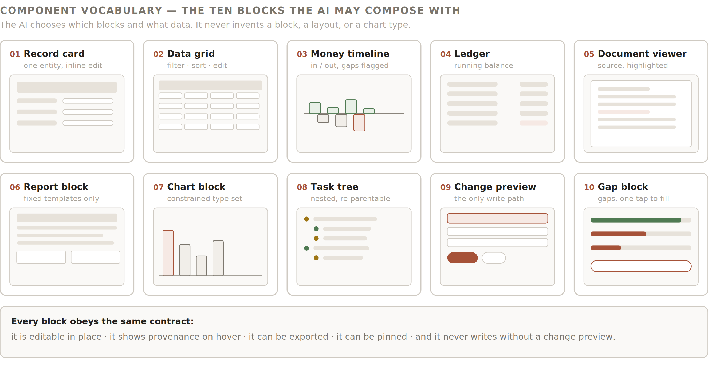
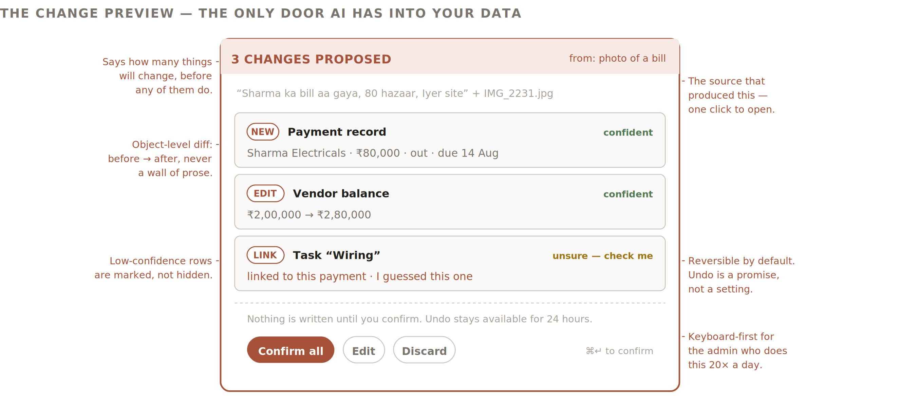

# 8 — Component Vocabulary

Ten blocks. This list is closed for the prototype: the AI composes from it and may not exceed it. Adding an eleventh block is a product decision, not a runtime one.

*Figure 13 — The ten blocks the AI may compose with.*
8.1  The blocks
#
Block
Holds
Editing
Appears in
01
Record card
One entity: canonical fields, status, provenance per field.
Inline, field by field.
Overlay panels, Canvas, People
02
Data grid
Any list of records. Filter, sort, group, column pick.
Cell-level inline edit; multi-select bulk actions.
Money, Projects list, Canvas
03
Money timeline
Inflows above axis, outflows below, coverage gaps shaded.
Drag a payment to reschedule → change preview.
Money, Home, Project workspace
04
Ledger
Running balance for one entity: planned, due, paid, outstanding.
Mark paid (full or partial), add a line.
People, Canvas
05
Document viewer
The source file with the relevant passage highlighted.
Read-only; “correct this extraction” opens a preview.
Evidence zone, Files, provenance clicks
06
Report block
Fixed templates only: project P&L, vendor exposure, ageing, salary sheet.
Parameters only (period, project, entity).
Canvas, pinned screens
07
Chart block
Bar, horizontal bar, timeline, stacked bar. Nothing else.
None. Click-through to the underlying grid.
Canvas, Firm Memory
08
Task tree
Nested tasks with assignee, deadline, status, linked payment.
Add, re-parent by drag, mark done, reassign.
Project workspace, Canvas
09
Change preview
A proposed set of writes, as a diff.
Edit any line before confirming.
Everywhere AI writes
10
Gap block
What is missing in this context, and what it blocks.
Answer inline.
Firm Memory, Canvas, empty states
8.2  The universal block contract
Every block, without exception, is:
	•	Editable in place. No block is a dead end that sends the user elsewhere to change something.
	•	Provenance-bearing. Hover or tap any figure to see its source and state.
	•	Exportable. CSV from any block holding rows; PNG or PDF from any block holding a visual.
	•	Pinnable. Individually, or as part of a Canvas.
	•	Write-gated. No block writes anything without a change preview.
8.3  Block 09 in detail — the change preview
The only door AI has into the firm’s data. Specified in full because getting it wrong invalidates the trust the whole product depends on.

*Figure 14 — Change preview anatomy.*
Element
Requirement
Header count
States how many objects will change before any of them do. “3 changes proposed”.
Source line
What produced this proposal — the voice note transcript, the file name, the message. One click opens it.
Per-object diff
Type tag (NEW / EDIT / LINK / DELETE), the object, and the change as before → after. Never a paragraph of prose describing changes.
Per-object confidence
Confident, or “unsure — check me”. Low-confidence rows are marked, never hidden, and never silently dropped.
Actions
Confirm all (primary), Edit, Discard. Keyboard: ⌘↵ confirms. The admin will do this twenty times a day.
Reversibility
Undo available for 24 hours on every confirmed change. Stated on the block itself, not buried in settings.
Audit
Every confirmed change writes an audit entry: who, what, when, from which source, with what confidence.
